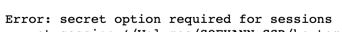
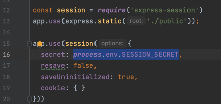
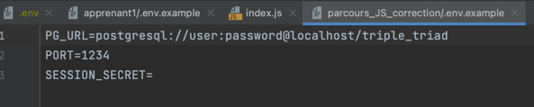
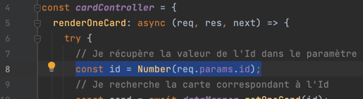
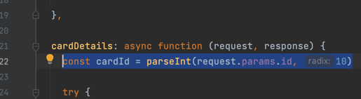
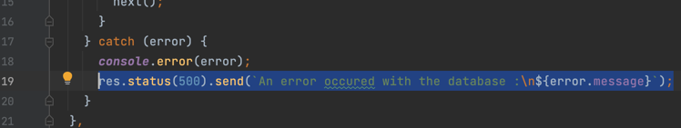
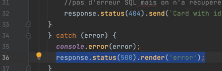
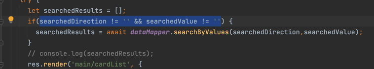
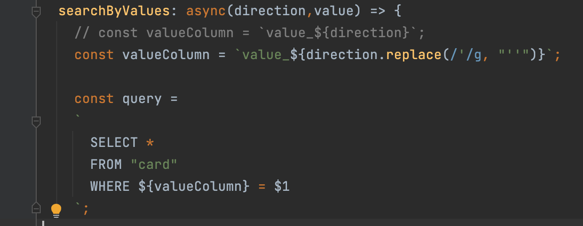
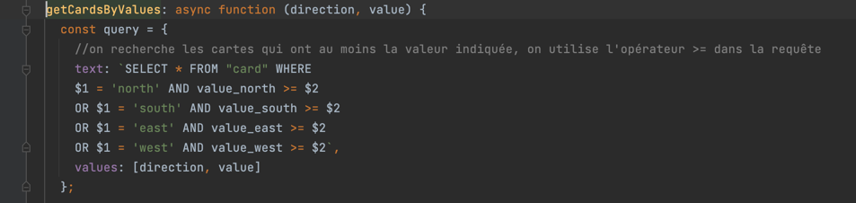

# Feedback pour le parcours Triple Triad

> Tout d'abord, bravo à toi, tu as réalisé l'ensemble des étapes attendues, y compris le bonus. 👏
> 
> Je te propose ici de voir quelques petites améliorations que tu pourrais apporter dans ton code.

---
## Lancement de l'application

J'ai rencontré un petit souci lorsque j'ai lancé ton application.



Dans ton code j'ai pu voir que tu avais utilisé une variable d'environnement `SESSION_SECRET` pour la configuration d'express-session que tu récupères avec `process.env.SESSION_SECRET` :



C'est très bien d'avoir fait comme ça, j'imagine que tu as bien déclaré `SESSION_SECRET` dans ton fichier `.env`, mais tu ne l'as pas ajouté dans le fichier `.envexample`.

Alors ce n'est pas grave, j'imagine que c'est un simple oubli. Mais comme tu peux le voir dans le fichier `.envexample` de la correction, `SESSION_SECRET` est bien précisé même s'il n'y a pas de valeur :



C'est important d'avoir un fichier `.envexample` qui reprend l'ensemble des variables du fichier `.env` pour permettre aux autres développeurs qui devront réutiliser ton code de connaître les variables d'environnement qu'ils devront mettre en place dans leur propre fichier `.env`, sachant que le fichier `.env` n'est pas partagé (pour des raisons de sécurité).

A part cet oubli, tu as vraiment très bien fait d'utiliser les variables d'environnement. Bravo ! 👌

---
## Etape 1 : Détail d'une carte
La première fonctionnalité attendue était le détail d'une carte, et tu l'as bien fait. On peut y accéder depuis la liste des cartes et depuis le deck !
On retrouve aussi toutes les informations d'une carte, bravo à toi ! 👏

Ton code aussi est très propre, que ce soit la route, le controller, la requête SQL ou la views.

Comme je vois que les différents concepts sont bien assimilés, je te propose deux petites améliorations de code que tu pourrais prendre en compte dans le futur.

### Amélioration 1

La première petite amélioration que je te propose est sur la récupération du paramètre `id` dans la requête.
Voici ton code :



Tu utilises la fonction `Number()`, pour convertir le paramètre en nombre.

Je te propose à la place, d'utiliser une autre fonction qui est `parseInt()` comme tu pourras le voir dans la correction :



L'avantage d'utiliser `parseInt()`, c'est que cette fonction permet de récupérer uniquement un nombre entier, ce qui est préférable pour la récupération de **l'id**, où l'on s'attend à avoir un nombre entier.

La fonction `parseInt()` est donc un peu plus précise que `Number()`.

Si tu souhaites en apprendre plus sur cette fonction voici de la documentation : https://developer.mozilla.org/fr/docs/Web/JavaScript/Reference/Global_Objects/parseInt

### Amélioration 2

La deuxième petite amélioration que je te propose concerne les messages d'erreurs :



Dans ton code, tu retournes le message d'erreur provenant de la base de données à l'utilisateur. 

Généralement, lorsqu'on a des erreurs internes (des erreurs 500), on évite de retourner le message provenant de la base de données à l'utilisateur, car ils sont souvent très détaillés et ils peuvent contenir des informations sensibles qui pourraient être exploitées par une personne malveillante.

A la place, en cas d'erreurs internes, tu pourrais tout simplement envoyer un message relativement simple que tu auras écris toi-même, comme tu peux le voir dans la correction :



---
## Etape 2 : Recherche
Tu as encore une fois un controller avec une fonction par formulaire de recherche, c'est une très bonne chose !
Le code de ta fonction `searchByElement()` ainsi que la requête SQL me semblent pas mal aussi. Bien joué ! 👏

---
## Etape 3 : Construire un deck
Tu as bien activé les sessions (n'oublie pas juste de faire attention aux variables d'environnement comme vu plus haut).

La fonctionnalité d'ajout fonctionne bien, tu as fait attention de bien vérifier que la carte n'est pas déjà présente dans le deck et que le deck n'est pas déjà constitué de 5 cartes. Bien joué !

La page du deck est pas mal aussi, tu récupères bien le deck depuis la session et tu prends en compte le cas où le deck est vide.

---
## Bonus : finir les recherches

### Recherche par level
Cette fonctionnalité est bien faite également, elle fonctionne bien, le code et la requête SQL me semblent aussi correctes.

### Recherche par valeur
La recherche par valeur fonctionne bien par contre j'aurai quelques recommandations d'amélioration ici.

#### Amélioration 1
La première, c'est lorsque tu vérifies que les valeurs "searchedDirection" et "searchedValue", tu utilises le comparateur "!=" :



Pour comparer searchedDirection, je te recommande d'utiliser le comparateur "!==" et non "!=".
Lorsque l'on souhaite comparer deux chaines de caractères (deux strings), on favorise l'utilisation de "!==".

<details>
<summary>
    Voici un petit rappel sur les différences entre "!==" et "!=" si tu en as besoin
</summary>

Quand tu utilises **"!="**, JavaScript va essayer de faire une conversion implicite dans le but de vérifier les valeurs que tu souhaites
comparer. C'est-à-dire que les **types** des variables sont convertis en un même type avant de faire la comparaison. Par exemple :

```javascript
5 != "5"  // retourne false
```

Par contre, **"!=="** est un comparateur plus strict. IL vérifie non seulement les valeurs mais aussi les types sans effectuer de conversion.
C'est-à-dire que les types des variables doivent être les mêmes avant de faire la comparaison (c'est à nous de faire la conversion). Par exemple :

```javascript
5 !== "5"  // retourne true
```

Comme tu peux le voir, le résultat de la comparaison est différent.

Il est généralement préférable d'utiliser **"!=="** car il est plus précis et il permet d'éviter des erreurs inattendues liées à la conversion de type.

</details>

#### Amélioration 2

Tu fais la même chose pour comparer "searchedValue" : `searchedValue != ''`.

Le problème, c'est que cette comparaison sera toujours vraie.
Parce que tu effectues une conversion avec la fonction `Number()` lorsque tu récupères **id** dans la requête.

Les valeurs possibles pour la variable "searchedValue" sont donc :

- soit un nombre dans le cas où la conversion a été réussi,
- soit la valeur NaN pour **Not A Number** dans le cas où **Number** n'a pas réussi à convertir la valeur que tu lui donnes en paramètres.

Ainsi : `searchedValue != ''` dans ton code sera toujours vrai (ou true).
Pour t'illustrer ça remplaçons searchedValue par nos valeurs possibles (un nombre ou NaN), on a donc :
- Dans le cas où notre fonction Number a réussi sa conversion, par exemple avec la valeur 10 voilà à quoi la comparaison ressemblera `10 != ''`
- Dans le cas où notre fonction Number n'a pas réussi sa conversion, par exemple avec la valeur 'toto', voilà à quoi la comparaison ressemblera `NaN != ''`

Comme tu peux le voir dans nos deux cas d'exemple, la comparaison sera toujours vraie (true) parce que 10 et NaN ne sont pas égaux à `''`

Mais du coup comment faire cette comparaison ?

En JavaScript on a une fonction vraiment sympa qui permets de vérifier si une valeur est un nombre ou NaN (Not A Number).

Cette fonction est `isNaN()`, cette fonction te renverra un boolean :
- **true** si la valeur est NaN ou toute autre valeur qui ne peut pas être converti en nombre (comme par exemple "toto")
- **false** si la valeur est bien un nombre ou une valeur qui peut être converti en nombre (comme par exemple "10")

Comment utiliser cette fonction ? C'est très simple, tu lui passe juste ta valeur ou ta variable en paramètre :

```javascript
if(searchedDirection !== '' && !isNaN(searchedValue)) {
  ...
}
```

Dans notre cas, la fonction renverra true si la valeur n'est pas un nombre et false si c'est un nombre (du coup on souhaite avoir false pour entrer dans notre if).

Voici la documentation de `isNaN()` si tu souhaites en apprendre plus : https://developer.mozilla.org/fr/docs/Web/JavaScript/Reference/Global_Objects/isNaN

#### Amélioration 3

J'ai pu voir que tu avais construit la requête SQL pour récupérer les cartes de la façon suivante :



Je te déconseille de faire ça comme ça pour plusieurs raisons :

La première est que tu définis la colonne de ta table en base de données en faisant une concaténation à partir de la saisit de l'utiliateur avec `${valueColumn}`.
Ceci est dangereux d'un point de vue sécurité, car vu que tu ne profites pas de la sécurité que t'offres les requêtes préparées, ta requête devient vulnérable aux injections SQL.
Un utilisateur malveillant pourrait donc en profiter.
Si tu veux en apprendre plus sur les injections SQL voici un lien : https://fr.wikipedia.org/wiki/Injection_SQL

Pour ce protéger des injections SQL, on ne fait JAMAIS de concaténation mais on utilises plutôt les requêtes préparées comme tu l'as très bien fait pour les autres requêtes.

La deuxième raison est que si l'utilisateur saisit n'importe quoi, ton application pourrait générer une erreur SQL et crash car la base de données ne connaîtra pas la colonne.

En résumé, on ne fait jamais de concaténation et on privilégie toujours les requêtes préparées lorsque l'on doit manipuler des variables.

Je t'invite à jeter un coup d'oeil à la correction :



### Recherche par nom

Ici tu as très bien fait ! Tu as bien construit la requête en prenant en compte le fait d'être non sensible à la `case`.

Bravo ! 👏