# Feedback pour le parcours Triple Triad

> Tout d'abord, tu as fait du bon travail, bravo à toi. 👏
>
> Je te propose ici de voir quelques petites améliorations que tu pourrais apporter dans ton code.

---
## Lancement de l'application

J'ai pu déployer l'application et l'exécuter sans problème. Bien joué 👌

---
## Etape 1 : Détail d'une carte

Tout d'abord, je vois que la page de détails d'une carte est bien accessible lorsque l'on clique sur une carte. Je vois que tu as bien créé un nouveau controller `cardsController` avec une fonction `item` pour les détails d'une carte.
Je vois aussi que tu as bien utilisé ce controller avec les routes. Bien joué !

Je te propose quelques petites améliorations :

### Amélioration 1

La première amélioration concerne la requête SQL que tu as faite :

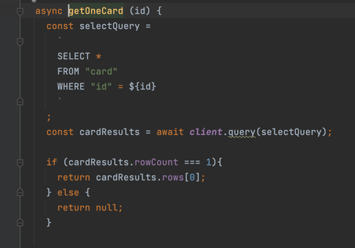

J'ai pu voir que tu n'avais pas utilisé de requête préparée, mais que tu avais plutôt fait une concaténation pour insérer l'id dans la requête.

    

        Voici un petit rappel sur les requêtes préparées. Je t'invite à revoir le cours sur le sujet si tu en as besoin.
    

Les requêtes préparées sont à favoriser pour plusieurs raisons : 

- Sécurité : Les requêtes préparées permettent de protéger les applications contre les attaques d'injection SQL en utilisant des paramètres pour les valeurs dans une requête plutôt que de les inclure directement dans la chaîne de requête. Cela permet d'échapper automatiquement les caractères spéciaux et de garantir que les valeurs fournies sont de types appropriés avant d'être utilisées dans la requête.
- Performances : Les requêtes préparées sont généralement plus performantes que les requêtes dynamiques, car elles peuvent être compilées une seule fois et réutilisées plusieurs fois, ce qui réduit les temps d'exécution et les ressources utilisées.
- Maintenabilité : Utiliser des requêtes préparées rend le code plus lisible et plus facile à maintenir car elles séparent les données des commandes SQL. Cela rend le code plus facile à comprendre et à déboguer.
- Types de données : Les requêtes préparées garantissent que les types de données sont corrects, alors que la concaténation de chaîne de caractères peut causer des problèmes de type de données.

Pour construire une requête préparée, tu peux tout simplement remplacer les variables par des paramètres "arbitraires", qui seront remplacées par nos valeurs lors de l'exécution de la requête.

Nos paramètres "arbitraires" sont écrit de la façon suivante : `$1`.
- Le **$** permets de dire à postgreSQL qu'il devra remplacer cette valeur.
- Le **1** permets de lui dire qu'il devra remplacer notre variable arbitraire par la **première** valeur qu'on lui passe en paramètres.

On peut donc remplacer `${id}` par `$1` dans la requête.

Ensuite, on a juste à transmettre les différentes variables en plus de la requête.

Je te propose de voir la requête réalisée dans la correction pour avoir un exemple plus concret sur comment utiliser une requête préparée :

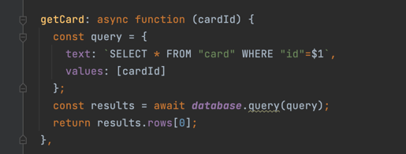

Comme tu peux le voir on construit la requête en lui indiquant le paramètre `$1` et en lui passant la variable `cardId` séparément.

### Amélioration 2

La deuxième amélioration concerne la gestion des erreurs. Notamment lorsque aucune carte a été trouvée.

Généralement lorsque l'on doit récupérer une ressource (ici notre carte) selon un élément fournit par l'utilisateur (ici l'id de la carte),
on doit toujours vérifier si la ressource a été trouvé ou non.

Dans le cas où la ressource est trouvé, c'est cool ! On continue et on lui affiche comme tu l'as fait.

Dans le cas où la ressource n'est pas trouvé, on doit le contrôler pour permettre à l'utilisateur d'être au courant que la ressource qu'il demande n'existe pas, mais aussi pour éviter que l'application crash.

Pour voir comment gérer ce type d'erreurs je t'invite à voir la correction : 

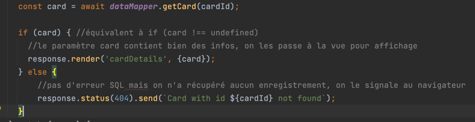

Comme tu peux le voir, si la carte existe, on passe les informations à la vue.

Dans le cas où la carte n'existe pas on entre dans le `else` et on retourne un message à l'utilisateur lui indiquant que la carte n'existe pas avec un code d'erreur **404**.

### Amélioration 3

La troisième petite amélioration que je te propose ici, c'est sur le nom de la fonction `item` dans le controller.

Je te recommande de donner un nom plus précis à ta fonction pour pouvoir t'y retrouver plus facilement.

Par exemple dans la correction, nous avons appelé la fonction `cardDetails` :

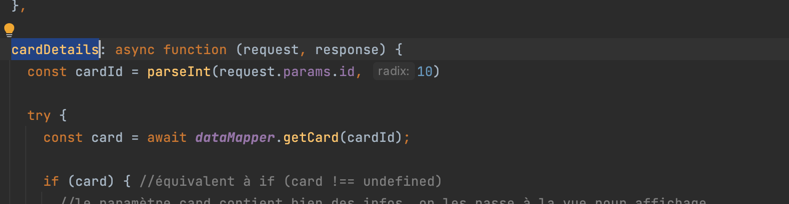

---
## Etape 2 : Recherche

Ici j'ai vu que tu as créé une nouvelle fonction dans le controller `searchController`, c'est très bien ! Il y a par contre quelques axes d'améliorations notamment sur ta façon de récupérer les cartes en fonction de l'élément souhaité.

J'ai pu voir que tu récupérais toutes les cartes grâce à la fonction `getElements()` de ton dataMapper et ensuite tu les filtres grâce à la fonction JavaScript `filter()` sur ton tableau de cartes :

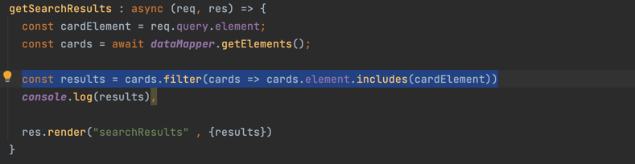

(Attention à la virgule après le `console.log`)

Dans la correction, on effectue le "filtre", directement via notre requête SQL grâce à une clause WHERE :

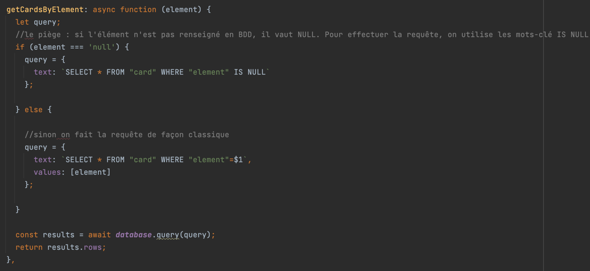

Comme tu peux le voir, ici on construit notre requête préparée en fonction de si l'élément est NULL (c'est-à-dire que la carte n'a aucun élément) ou s'il y a une autre valeur.

Le résultat de la requête sera donc déjà **filtré** grâce à notre clause **WHERE**, ainsi on aura donc toutes les cartes que l'on souhaite et il n'est pas nécessaire d'effectuer un filtre en JavaScript. Comme tu peux le voir dans le controller de la correction :

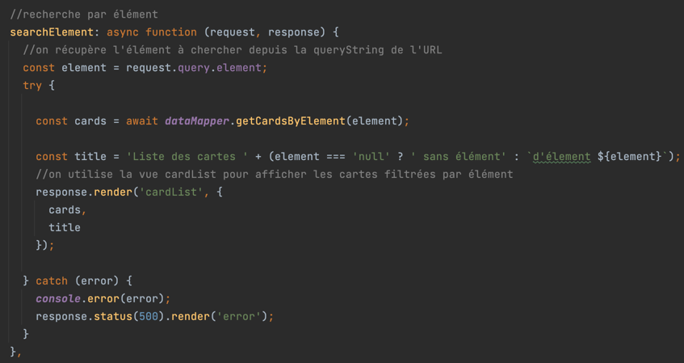

Pourquoi effectuer le filtre directement via la requête ? Et bien pour plusieurs raisons :

- Les performances, le fait de trier les cartes directement en javascript peut être gourmand en ressources et donc impacter négativement les performances de l'application.
- Toutes les données sont déjà présentes dans la base de données, ainsi il est beaucoup plus rapide d'effectuer le "filtre" dans la base de données directement et de traiter dans notre application uniquement les cartes dont on a besoin.
- C'est beaucoup plus facile à maintenir !

 
Je t'invite à revoir le cours sur SQL et si tu as des questions n'hésites pas à me les poser !

---
## Etape 3 : Construire un deck

### Activer les sessions 

Tu as bien activé les sessions avec `express-session`, bien joué ! 👌

Il y a une petite amélioration que tu pourrais apporter lors de la configuration d'express-session.
Plus particulièrement concernant le secret :
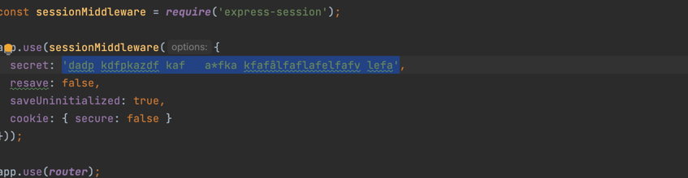

Comme tu peux le voir dans la correction, on n'écrit pas directement le **"secret"** en dure :

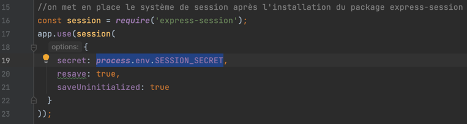

Je t'invite à voir la correction notamment le fichier `.envexample` pour voir comment mettre en place la variable `SESSION_SECRET`.

### Ajouter une carte

Alors j'ai pu voir que tu vérifies bien les cartes déjà présentes pour t'assurer de ne pas avoir de doublons, bien joué !

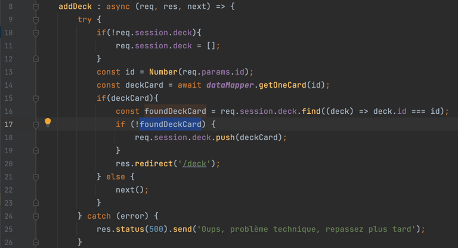

Il manque un tout petit bout de code pour ne pas ajouter de carte si le deck en contient déjà 5.

Comme tu peux le voir dans la correction, on ajoute une condition supplémentaire où on vérifie tout simplement s'il n'y a pas déjà 5 cartes dans le deck :

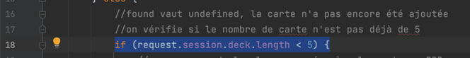

Si tu veux aller plus loin je t'invite à lire la correction pour voir comment optimiser encore plus cette vérification.

### Page pour visualiser le deck

Tu as construit une page pour visualiser le deck dans un tableau, bravo ! 👏

### Suppression d'une carte du deck

Il semblerait que tu n'ai pas fait la fonctionnalité pour supprimer une carte du deck.
Ce n'est pas grave, je t'invite à lire la correction pour voir comment tu aurais pu faire.

---
## Bonus : finir les recherches

Je t'invite également à lire la correction pour voir comment les formulaires de recherches ont été finalisés.