# Feedback pour le parcours Triple Triad

> J'ai pu remarquer quelques soucis dans ton code, principalement sur les views. Je t'invite à lire ce feedback et de revoir cette notion du cours tranquillement.
>
> Certaines étapes ne sont pas finies, ce n'est pas grave ! N'hésites pas à voir la correction pour voir comment elles ont été faites.

---
## Lancement de l'application

J'ai pu déployer l'application et l'exécuter sans problème. Bien joué 👌

J'ai cependant pu remarquer que dans ta liste des cartes présente dans la page d'accueil tu avais un doublon sur les liens :

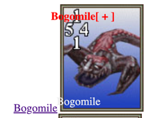

On peut voir que sur la gauche, tu as un lien "Bogomile" et que la carte n'est plus cliquable.

J'ai pu voir que tu avais ajouté ce petit bout de code dans ta view :

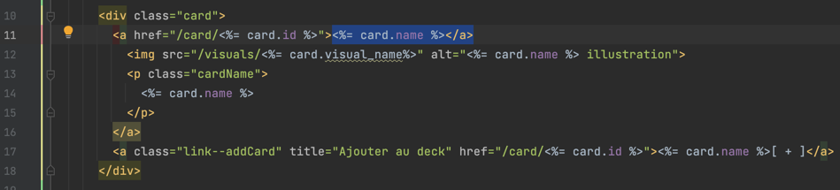

Ce qui a "cassé" le lien qui était là de base dans la view de la consigne :

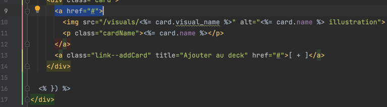

Comme tu peux le voir dans la consigne, on a la balise ouvrante à la ligne 9 dans ma capture d'écran et on a la balise fermante à la ligne 12.

Lorsque tu as ajouté le petit bout de code incluant une balise fermante, tu as "cassé" le lien qui était présent de base. On se trouve donc avec une balise fermante `</a>` qui n'a pas de balise ouvrante.

Pour rappel :
- On a UNE balise fermante pour UNE balise ouvrante
- Lorsque tu as une balise `` tu n'es pas obligé d'avoir du texte à l'intérieur. Enfaite, tout ce qui est présent entre la balise ouvrante et la balise fermante fait partie du lien.

Je t'invite à voir la correction pour voir comment le lien a été construit pour accéder aux détails d'une carte.

J'ai vu que tu avais bien mis la bonne route dans l'attribut **href** de la balise **a**, ça, c'est très bien !

---
## Etape 1 : Détail d'une carte

Lorsque je clique sur un des liens pour accéder à la page de détails d'une carte, l'application crash avec le message d'erreur :

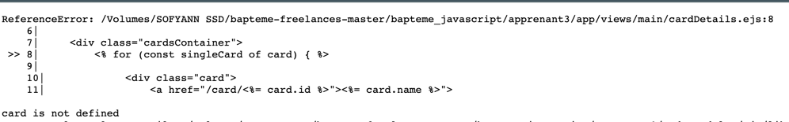

Je te propose de nous attarder quelques instants sur ce message pour bien comprendre ce qu'il se passe.
Sur la première ligne de l'erreur on peut voir dans quel fichier l'erreur s'est produite, ici dans notre fichier `cardDetails.ejs`
Les lignes suivantes nous indique précisement, où dans le fichier, il y a eu un soucis. Ici c'est à la ligne 8.
Enfin, la dernière ligne, nous indique **card is not defined**.

On pourrait traduire ça de la façon suivante :
- Dans notre fichier cardDetails.ejs
- On utilise une variable **card** à la ligne 8
- Mais notre fichier cardDetails.ejs ne connait pas cette variable.

Pour rappel, c'est au controller, de donner les variables à la view (à nos fichiers .ejs).

Allons donc voir notre controller et voir s'il passe bien la variable **card** à la view.

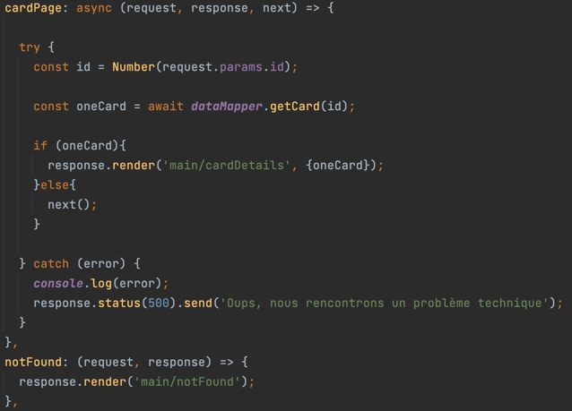

Alors ici, on peut voir que dans le controller, on passe une variable **oneCard** à la view. Mais notre view souhaite accéder à une variable **card**.

Comment résoudre le problème ?

Pour rester simple ici, il faut s'assurer, de toujours utiliser les bons noms de variables dans notre view, c'est-à-dire, le nom de la variable qu'on lui donne depuis le controller.

Pour corriger facilement le souci ici, on a juste à renommer notre variable **oneCard** par **card** dans le controller (ou inversement renommer card par oneCard dans la view, il faut juste s'assurer d'avoir le même nom) :

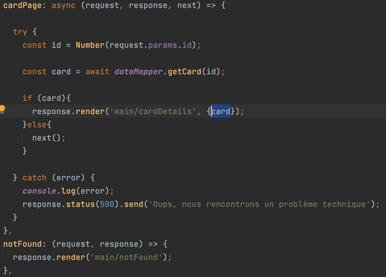

On a maintenant un nouveau message d'erreur :

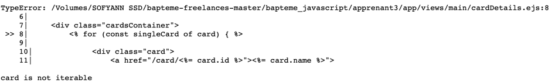

Je te propose de suivre le même process que pour l'erreur précédente. Où on peut traduire le message de la façon suivante :
- Dans notre fichier `cardDetails.ejs`
- On utilise une variable **card** à la ligne 8.
- Notre variable existe bien mais le message nous dit que cette variable n'est pas **"iterable"**.

Alors quel est le problème ici ?

On utilise une boucle for, sur une variable qui ne contient pas un tableau, mais un objet. (Notre variable card contient une seule carte et pas plusieurs)

Pour rappel, la boucle for, doit être utilisée pour parcourir un tableau, elle ne peut pas être utilisée de cette façon pour parcourir un objet.

Pour corriger ce problème, on peut tout simplement enlever la boucle parce qu'on en a pas vraiment besoin ici, sachant que tu utilises directement **card** pour afficher les différentes valeurs.

Voici à quoi ressemble le code de notre view sans la boucle :

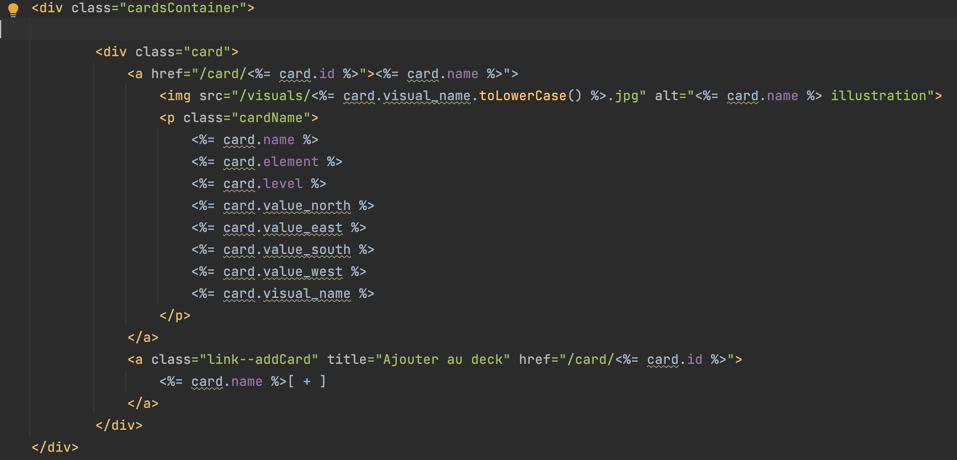

J'espère que tu y verras plus clair sur la façon de corriger des bugs dans ton application à partir des messages d'erreur.
Je sais qu'au début ces messages peuvent faire peur ! Mais crois-moi, ils sont très utiles.

Je t'invite aussi à revoir le fonctionnement des views avec EJS. Tu trouveras de la documentation à l'adresse : https://ejs.co/

Il y a un dernier petit soucis que l'on peut identifier dans cette view :

Comme tu peux le voir l'image ne charge pas.

Ceci est dû au fait que dans le code de ta view tu ajoutes **.jpg** au nom du fichier dans l'attribut **src** de ta balise **img** :

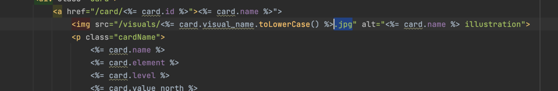

Le problème est que l'extension **.jpg** est déjà présente dans la propriété **visual_name** de notre carte.
Si on jette un coup d'œil à nos données dans la base de données, on peut confirmer ça rapidement :

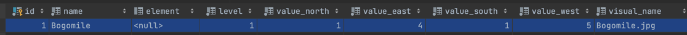

Comme tu peux le voir dans la colonne **visual_name** pour notre carte Bogomile, l'image est Bogomile.jpg, l'extension est donc déjà présente.
Si tu ajoutes une seconde fois l'extension **.jpg**, notre navigateur va essayer de télécharger une image **Bogomile.jpg.jpg**, avec 2 fois .jpg et donc c'est pour ça qu'il ne trouve pas l'image.
Pour régler le problème, c'est donc assez simple, on peut enlever le **.jpg** ajouté dans la view pour ne plus avoir de doublon :

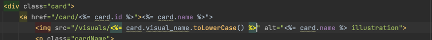

Et on peut voir que notre image charge correctement :

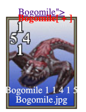

Je t'invite à lire la correction et revoir le cours sur le HTML et les templates avec EJS. 

Tu trouveras également la documentation de EJS à l'adresse suivante : https://ejs.co/

---
## Etape 2 : Recherche

Alors ici il y a juste eu un petit oubli d'import. Dans ton fichier searchController.js, tu as oublié d'importer dataMapper, ainsi lorsque ton code est exécuté, il crash.

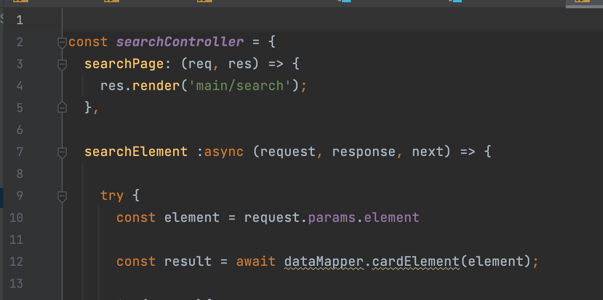

Comme tu peux le voir, à la ligne 12, tu utilises `dataMapper.cardElement(element)` par contre comme tu peux le voir à la ligne 1 (tout en haut du fichier), tu n'as pas importer dataMapper.

Voici comment l'importer au cas où :

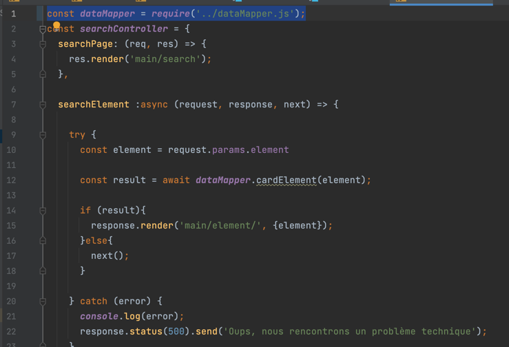

Il te suffit d'utiliser la fonction `require()` et de lui donner en paramètre le chemin vers le fichier de ton choix (ici dataMapper).

> Attention à ne pas oublier d'importer tous les éléments dont on a besoin dans chaque fichier.

Enfin, tu utilises une fonction `cardElement()`, qui n'existe pas, je t'invite à voir la correction pour voir comment tu aurais pu la construire.

---
## Etape 3 : Construire un deck

Cette étape n'est visiblement pas faites, je t'invite à voir la correction pour comprendre comment tu aurais pu faire. Si tu as des questions, je suis là !

---
## Bonus : finir les recherches

Cette étape n'est visiblement pas faites, je t'invite également à voir la correction.