# Feedback pour le parcours Triple Triad

> Il est difficile pour moi de t'apporter un feedback adapté au vu du travail fournit. 
> Je ne peux pas savoir à ce stade s'il s'agit d'une incompréhension globale ou si tu as rencontré des problèmes spécifiques qui ton empêché de réaliser l'exercice.
> J'ai vu que tu avais commencé l'étape 1 du challenge, je te propose ici de la finaliser ensemble pour t'apporter une explication sur la façon dont tu aurais pu procéder.
> Je t'invite ensuite à prendre le temps de voir la correction fournit et de refaire le challenge à tête reposé pour t'exercer.
> Et si tu as besoin d'aide, je suis là !

J'ai vu que tu as commencé la première étape concernant la page de détails d'une carte.

Alors j'ai vu que tu avais commencé par créer une fonction `cardPage` dans le controller `mainController.js` ainsi que la fonction `getCard(id)`
pour récupérer les données dans la base de données dans le fichier `dataMapper.js` c'est déjà très bien, tu est pas loin !

Dans le fichier router.js tu as ajouté une route `/card` avec ton controller, il manque juste une toute petite chose, mais c'est déjà très bien !

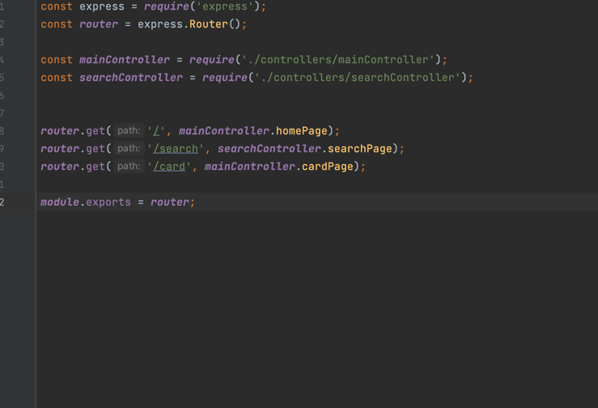

Je te propose d'ajouter dans notre route le paramètre id pour pouvoir récupérer l'id de la carte dans notre controller et ensuite récupérer les données de la carte en base de données.

Pour ajouter un paramètre à une route, c'est très simple :

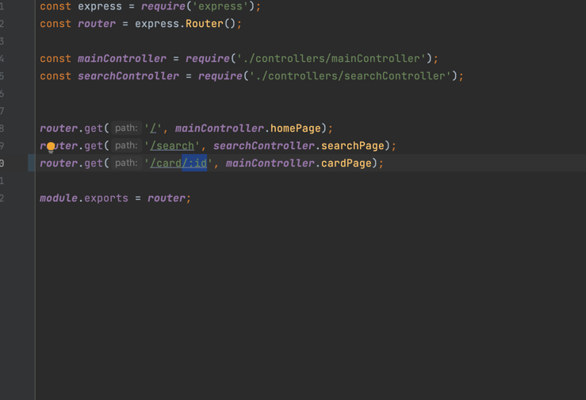

Comme tu peux le voir j'ai ajouté `/:id` pour indiquer à express qu'on attend un paramètre à un certain endroit de notre route (dans notre cas ici, l'id), il suffit d'écrire `:` suivi du nom du paramètre et il se charge du reste !

Par exemple si l'utilisateur souhaite accéder à la carte avec l'id 10, notre route deviendra `/card/10`, express se chargera de remplacer `:id` par 10, c'est plutôt cool non ?

Maintenant que notre route est ok, je te propose de retourner dans notre controller pour récupérer le paramètre id de la requête.

Voici le code que tu as déjà écrit :

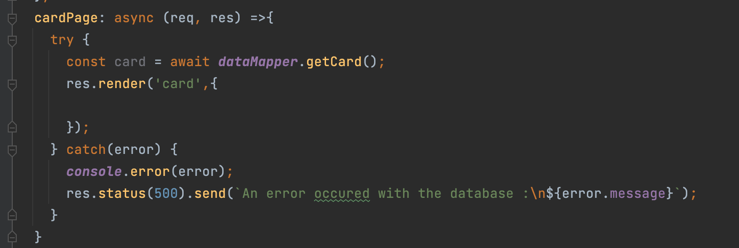

Notre fonction cardPage a deux paramètres : **req** et **res**.

**req** contient l'ensemble des éléments propre à la requête de l'utilisateur, c'est donc grâce à cette variable qu'on pourra récupérer notre fameux id.

Pour récupérer un paramètre, il suffit de faire :

`request.params.MON_PARAMETRE`, où **MON_PARAMETRE**, est le paramètre qu'on a indiqué à express directement dans nos routes (dans le fichier router.js).

Dans notre cas **MON_PARAMETRE** peut donc être remplacé par "id".

Dans notre code on a donc :

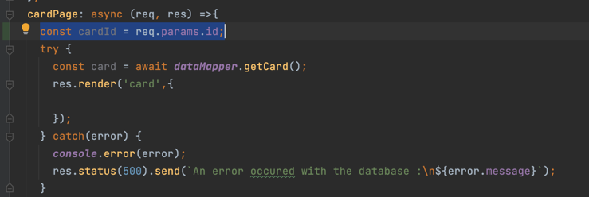

Il y a encore une petite étape pour récupérer notre id convenablement. Lorsque l'on récupère un paramètre de notre requête via `request.params.MON_PARAMETRE` la valeur de la requête est toujours une chaîne de caractère.
Par contre, dans notre projet, on souhaite que l'id soit un entier, parce que dans notre base de données les id sont des entiers.
Il suffit donc de convertir la valeur de `request.params.id` en entier. On peut faire ça grâce à la fonction `parseInt()` (voici une documentation sur cette fonction si tu le souhaite :https://developer.mozilla.org/fr/docs/Web/JavaScript/Reference/Global_Objects/parseInt)

Voici notre code avec la conversion :

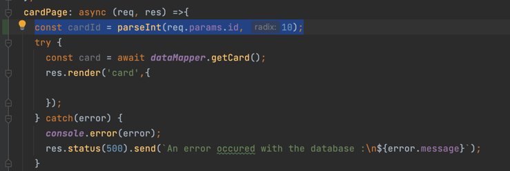

Ainsi, notre constante `cardId`, contiendra un entier, qui est notre id.

La prochaine étape consiste à utiliser cet id, pour récupérer notre carte en base de données.

Mais avant je te propose de faire un tour dans notre fichier `dataMapper.js`, notamment dans la fonction `getCard()` que tu as créé.

Voici la fonction tel que tu l'as écrite :

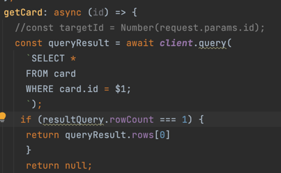

On peut voir que tu as déjà mis en paramètre de ta fonction "id", c'est déjà très bien !

Tu as aussi déjà construit la requête SQL sous forme de requête préparée, c'est très bien aussi !

Il nous suffit donc d'ajouter l'id en paramètre de la fonction query :

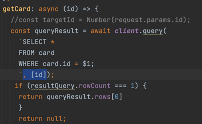

Alors, il y a une petite erreur dans ta condition qui suit la requête :

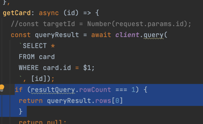

Tu utilises une variable **resultQuery** qui n'existe pas, j'imagine que tu voulais utiliser **queryResult**, je te propose de la remplacer :

Maintenant retournons dans notre controller pour utiliser convenablement la fonction `getCard()`, où on va simplement lui transmettre notre constante **cardId** :

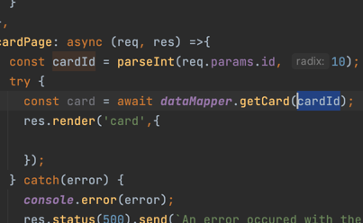

Ensuite, dans notre controller on a encore une petite étape, transmettre le résultat de notre fonction (les données de notre carte) à notre view pour pouvoir l'afficher :

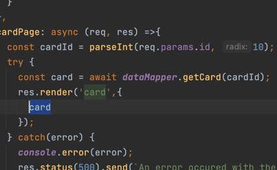

Ici tu étais pas loin, j'ai juste ajouté "card" dans l'objet contenant tous les éléments que l'on souhaite transmettre à notre view.

Allons dans notre view maintenant. J'ai vu que tu avais juste copier-coller le contenu de la view "cardList.ejs", je te propose donc de l'enlever et de remplacer par le code déjà présent dans la correction :

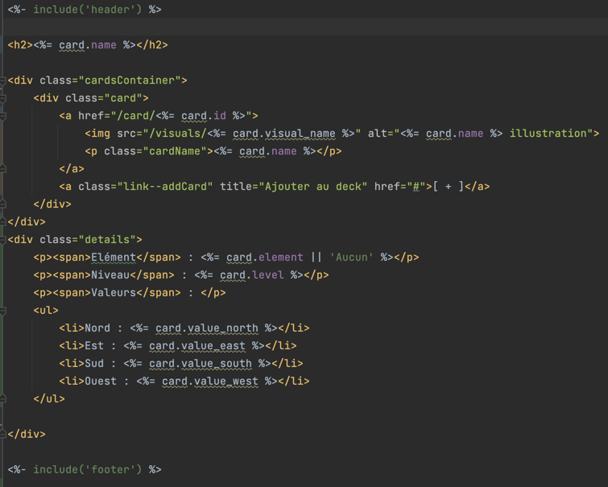

Comme tu peux le voir on construit tout simplement notre page HTML avec les données de notre "card" fournit par le controller.

La dernière étape maintenant !

Dans notre view cardList.ejs (qui est la view affichant la liste de toutes les cartes sur la page d'accueil de notre application), il nous reste juste à faire fonctionner les liens lorsque l'ont clique sur une carte.

Ici il nous suffit juste d'ajouter la route dans notre balise `<a href="#"> ... </a>` :

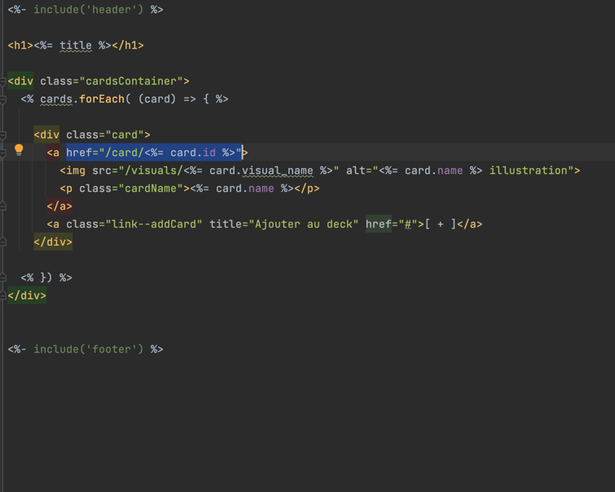

Comme tu peux le voir j'ai juste remplacé `#` par `/card/<%= card.id %>`. Je t'invite à revoir le cours sur EJS, si ce n'est pas clair pour toi.

Et ... TADAM ! Notre page de détails prend vie :

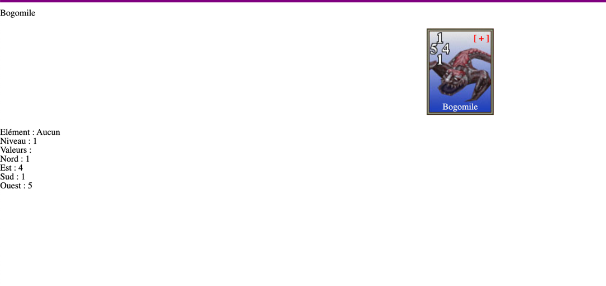

Voilà, c'est tout ce qui était attendu pour l'étape 1 du challenge, j'espère que mon petit guide te sera utile pour les prochaines challenges.