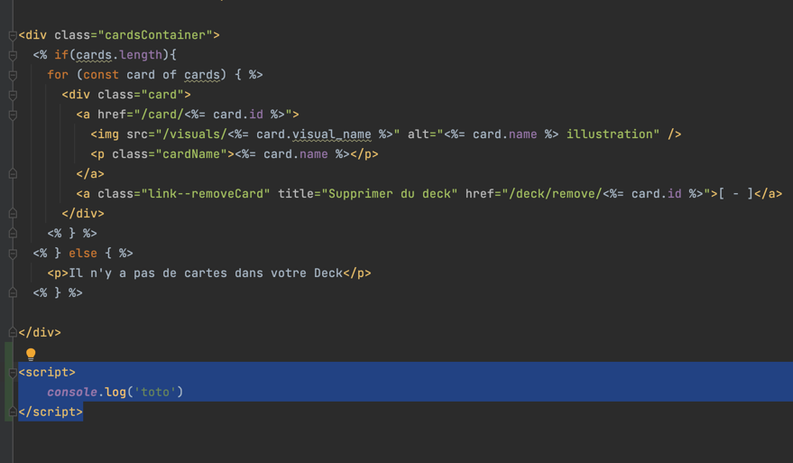
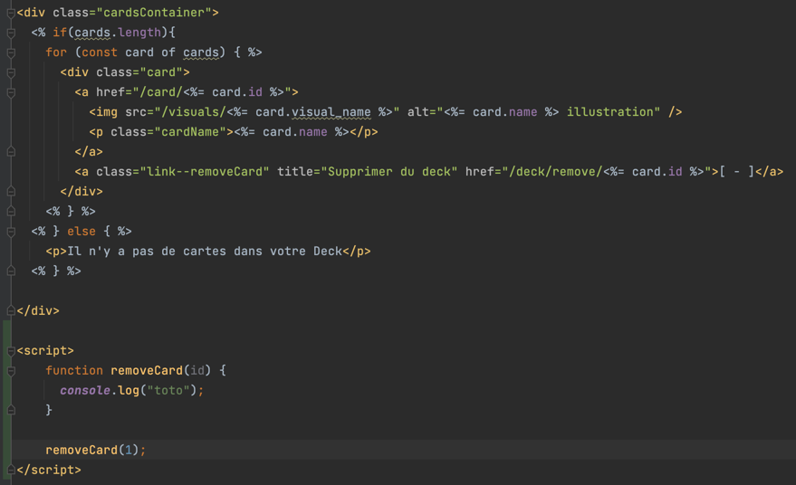
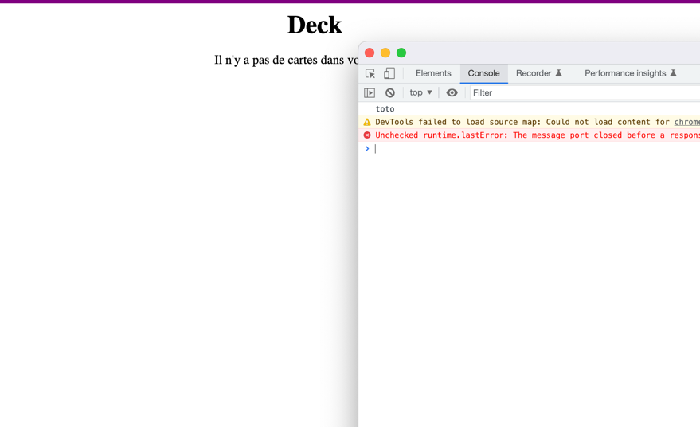
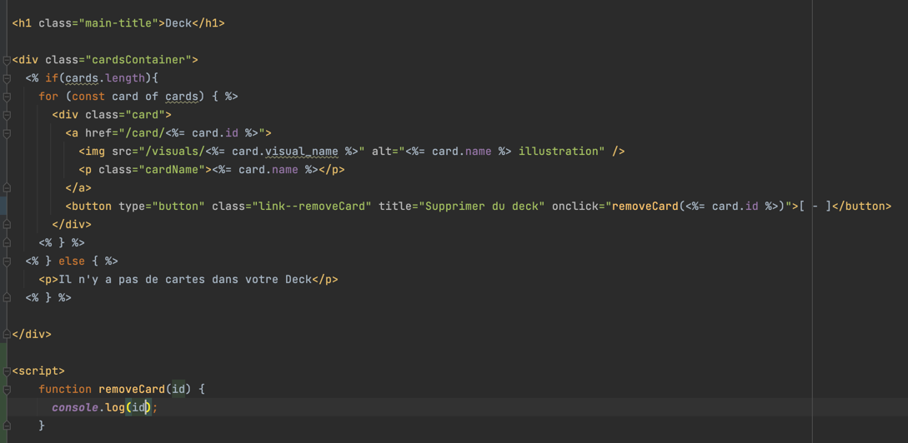
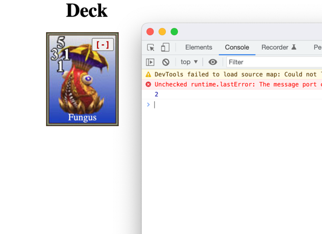
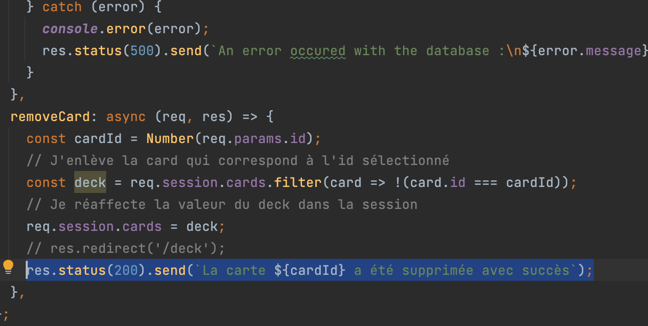
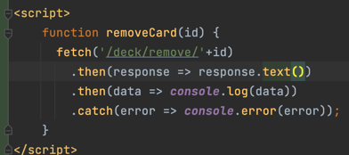
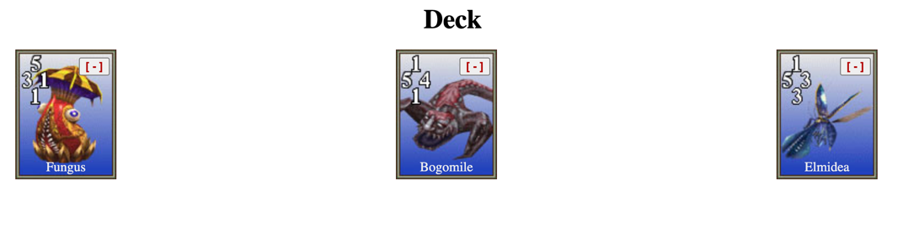
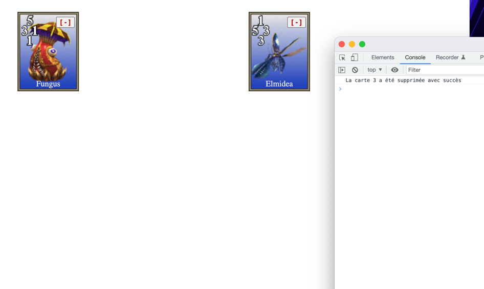

# Conseil technique avancé

>Tout d'abord, bravo pour ton travail !
>Comme demandé, je te propose une petite explication sur la notion de fetch.

## Qu'est-ce que fetch ?
Tout d'abord, qu'est-ce que fetch ?

Et bien fetch est une méthode en JavaScript, qui permet d'effectuer des requêtes HTTP dynamiquement.
C'est-à-dire, que l'on peut effectuer des requêtes directement depuis notre code JavaScript. 

C'est très utile parce que ça permets de pouvoir effectuer des requêtes sans avoir à rafraichir une page par exemple.

Permets-moi de te donner un exemple de scénario où fetch serait très utile.

Imaginons que tu développes une application web comme YouTube, où on a des boutons pour des "like", pour "partager"...

Pour rendre l'utilisation de ces applications plus sympa, on fait en sorte de ne pas rafraichir toute la page d'un utilisateur lorsqu'il clique sur un bouton "like" par exemple.

Pourtant, lorsqu'on clique sur like, il y a bien quelque chose qui se passe, une requête qui est faite pour dire au backend "HEY, J'AI MIS UN LIKE SUR CETTE VIDEO INCREMENTE LE NOMBRE DE LIKES"

On fait ça grâce à notre fetch. Avec fetch, on peut effectuer une requête et traiter la réponse sans avoir à rafraichir toute la page !

Alors, on peut utiliser fetch pour d'autres raisons, comme par exemple, depuis notre backend Node.JS vers un autre backend (mais je t'invite à d'abord comprendre le fonctionnement de fetch côté client avant de voir des scénarios plus compliqués)

## Comment l'utiliser ?
La fonction fetch s'utilise de cette façon :

```javascript
fetch('https://NOTRE_URL.FR')
    .then(data => console.log(data))
    .catch(error => console.error(error))
```

- D'abord on appelle la fonction fetch et on lui passe en paramètre l'URL de notre choix
- On écris un premier `.then()` qui sera exécuté une fois que la requête est finie. Ici, on fait une juste un `console.log` de data (data étant le résultat de la requête)
- On ajoute un `.catch()` cette fonction permets de lui dire que s'il y a une erreur (par exemple une erreur 404) on va la traiter ici.

Comme tu le vois, c'est très simple à utiliser.

## Exemple

Je te propose un exemple un peu plus concret pour toi en utilisant la fonctionnalité de suppression d'une carte du deck que tu as développée.

Comme tu as dû le remarquer, lorsqu'un utilisateur supprime une carte de son deck, la page est actualisée parce que tu fais une redirection.

Je te propose que lorsque qu'on clique sur le bouton de suppression d'une carte du deck, au lieu d'utiliser un lien, on va tout simplement utiliser un bouton qui va déclencher notre fetch directement dans le navigateur.

Allons donc dans le fichier `deck.ejs` et ajoutons une petite balise `<script>...</script>` qui contiendra du code JavaScript qui sera exécuté dans le navigateur de l'utilisateur. (Alors il serait plus propre de créer un fichier javascript et de mettre le code dedans mais ici je te propose d'aller au plus simple pour nous concentrer sur fetch).



Dans notre balise javascript, créons une petite fonction que l'on appellera **removeCard** et qui prendra en paramètre l'id de la carte :

Je te propose de seulement y mettre un `console.log` et d'exécuter la fonction pour tout simplement nous assurer que tout fonctionne :



On peut voir que pour l'instant, c'est OK :



Maintenant remplaçons notre balise `<a> </a>` qui était utilisée pour supprimer une carte par un simple bouton.



Comme tu peux le voir, à la place de l'attribut **href** utilisé pour les liens, j'utilise l'attribut **onclick** dans lequel j'appelle la fonction **removeCard** que nous avons créé en plus passant en paramètre l'id de la carte.
J'ai aussi remplacé le `console.log` de "toto" par l'id pour nous assurer qu'on le récupère bien.
Maintenant ajoutons quelques cartes et testons !



Comme tu peux le voir lorsqu'on clique sur le bouton, on a bien l'id de la carte qui s'affiche dans la console.

Alors avant d'aller plus loin dans notre script et d'ajouter le fetch, je te propose d'aller dans le controller pour remplacer la redirection par une simple réponse qui dit "La carte a été supprimée avec succès" :



Comme tu peux le voir ici, j'ai commenté la redirection pour que tu puisses t'y retrouver et dans la ligne juste en dessous on retourne une réponse 200 avec notre petit message.

Retournons dans notre template, c'est le moment d'utiliser fetch !



J'ai donc remplacé notre `console.log(id)` par fetch et je l'utilise exactement comme je te l'ai expliqué plus haut où j'utilise la route de suppression d'une carte et lui passant l'id.
J'ai aussi ajouté une fonction `.then(response => response.text())` pour dire à fetch que l'on souhaite lire du texte brut. Ça sera plus lisible dans la console pour notre exemple.

>Si tu souhaites manipuler du JSON par exemple tu as juste à remplacer **.text()** par **.json()** !

Il faut juste faire attention à avoir les `.then()` dans le bon ordre comme dans l'exemple que je t'ai montré.
Tout me semble OK, testons !




J'ai ajouté 3 cartes dans mon deck pour l'exemple, j'ai pris les trois premières cartes. Supprimons "Elmidea" en cliquant sur le bouton et regardons la console :


TADAM ! J'ai bien mon message qui me dit que ma carte a été supprimée et ma page ne s'est pas actualisé. Tout s'est passé "en coulisses" !

Alors la carte est toujours visible même si elle a été supprimée, tout simplement parce que je fais seulement un `console.log(data)` dans le `.then` de mon fetch.

Si on veut qu'elle soit supprimée de la page HTML, il suffit d'écrire le code adéquat à la place du `console.log`. D'ailleurs tu pourrais le faire pour t'exercer !

## Petits exercices pour bien assimiler fetch (Si tu le souhaites)
- Ecrire le code JavaScript qui supprimera la carte du HTML lorsque le fetch est exécuté.
- Je t'invite à essayer de faire la même chose avec l'ajout d'une carte dans le deck en utilisant fetch. Si tu as besoin d'aide n'hésites pas !