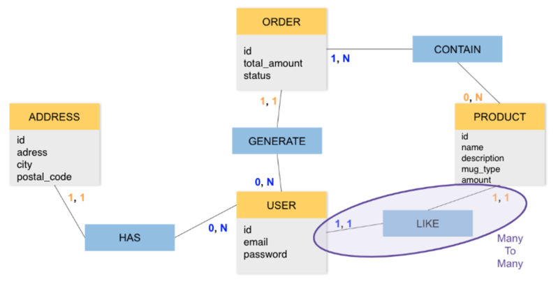
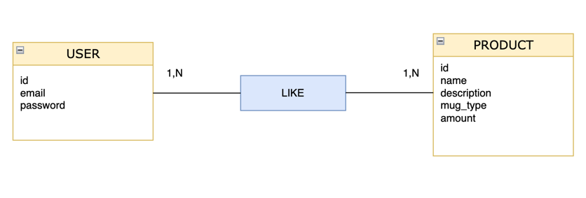

Salut,

> Voici un feedback détaillé sur le MCD que tu as réalisé. Tout d'abord tu as fait du très bon boulot bravo !

## Analyse du MCD

Voici le MCD que tu as réalisé :

Je te propose d'analyser chaque relation une par une :

### La relation **"ADDRESS"** - HAS - **"USER"** :
Dans ton MCD, un **USER** peut avoir aucune ou plusieurs **ADDRESS** mais une **ADDRESS** doit avoir 1 et 1 seul **USER**, c'est très bien !

### La relation **"USER"** - GENERATE - **"ORDER"** :
Ici un **USER** peut avoir aucune ou plusieurs **ORDER** et comme pour les adresses, un **ORDER** doit avoir 1 et 1 seul **USER**, c'est très bien aussi.

### La relation **"ORDER"** - CONTAIN - **"PRODUCT"** :
Un **ORDER** doit avoir au minimum 1 et il peut avoir plusieurs **PRODUCT**, par contre **PRODUCT**, n'est pas forcément lié à un **ORDER** ou il peut être lié à plusieurs **ORDER** (Donc un produit peut avoir été ajouté dans aucune ou plusieurs "commande", et une commande doit avoir au minimum 1 produit ou en contenir plusieurs). Ca me semble bien ! Bravo à toi !

### La relation **USER** - LIKE - **PRODUCT** :
Alors ici je pense qu'il  y a un petit soucis, le MCD indique qu'un **USER** peut **LIKE** un et un seul produit (et un produit peut être "liké" par un seul user).

Dans l'exercice il est dit qu'un utilisateur peut "liker" un produit (ou plusieurs).
Donc un produit peut avoir plusieurs "like" (des likes de différents utilisateurs).

Avec une cardinalité **1,1**, un utilisateur peut liker 1 et 1 seul produit et un produit peut être liké par 1 et 1 seul utilisateur. La cardinalité 1,1 n'est donc pas vraiment adaptée ici.

Ici, nous pouvons utiliser une association de type Many To Many (ou N, N), c'est à dire que plusieurs utilisateurs peuvent "liké" le même produit et les utlisateurs peuvent bien sur "liké" plusieurs produits.

Comment mettre en place cette association ?

Et bien on doit créer une entité "intermédiaire" qui est située entre les entités **PRODUCT** et **USER**.
Cette entité intermédiaire aura une clé primaire qui sera composée des clés étrangères référençant **PRODUCT** et **USER**

    

        Si tu as besoin d'un petit rappel sur les clés étrangères et primaires en voici un, mais si tu veux plus de détails je t'invite à revoir le cours
    

- Les clés primaires : elles permettent d'identifier de manière unique chaque ligne de notre table (ou entité), comme par exemple "id".
- Les clés étrangères : elles font référence à une clé primaire d'une autre table (ou entité) et permettent donc de créer des relations entre les entités.

Dans notre cas l'entité **USER** dispose d'une clé primaire **id** (qui permet d'identifier chaque utilisateur) et on a la même chose côté **PRODUCT**, avec également une clé primaire **id** qui permet d'identifier chaque produit.
C'est déjà très bien.
On aura donc une troisième entité (par exemple LIKE), qui contiendra une clé primaire composée de 2 propriétés (par exemple **idUser** et **idProduct**)

Pour modéliser une relation Many To Many dans un MCD selon **MERISE** :

- Remplacer l'association 1,1 à droite de **USER** qui est lié à **LIKE** par 1, N
- Remplacer l'association 1,1 en dessous de **PRODUCT** qui est lié à **LIKE** par 1, N

Ainsi, on pourrait traduire ça par :
- Un utilisateur peut **"like"** plusieurs produits
- Un produit peut être **"liké"** par plusieurs utilisateurs

Visuellement, voilà à quoi pourrait ressembler cette relation :

## Exemples d'outils

Voici une liste d'outils vraiment sympa permettant de réaliser des MCD :

- draw.io : c'est une web app du coup tu n'as rien besoin d'installer et c'est très facile à utiliser ! Voici le lien : https://app.diagrams.net/
- UMLet : cet outil est un logiciel a installer, il permet de réaliser de nombreux diagrammes UML ainsi que les MCD, il est aussi très facile à utiliser. Tu pourras le télécharger ici : https://www.umlet.com/
- Edraw : cet outil contient de nombreux modèles et il permets de faire des diagrammes MCD assez rapidement. Par contre il me semble qu'il est devenu payant, je te mets quand même le lien si tu souhaites te renseigner : https://www.edrawsoft.com/fr/edraw-max/
- Oracle SQL Data Modeler : Alors malgré son nom un peu long, cet outil est vraiment pas mal et il est lui aussi totalement gratuit. Voici le lien pour le télécharger : https://www.oracle.com/fr/database/sqldeveloper/technologies/sql-data-modeler/