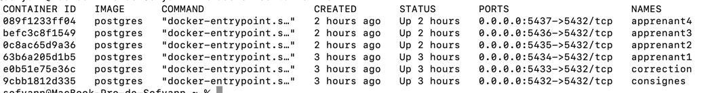

# Baptême tuteurs freelances

## Introduction

Bonjour,

Je me suis permis d'ajouter, ce fichier, en plus des différents livrables demandés dans lequel je décris l'environnement de travail que j'ai mis en place avec Docker.

### Environnement

J'ai utilisé l'IDE Webstorm pour l'analyse du code et DataGrip comme client de base de données.
Je trouve que DataGrip est vraiment pas mal notamment pour se connecter à plusieurs base de données
simultanément pouvoir les comparés sans avoir à se reconnecter à chaque fois.

J'ai aussi utilisé Docker pour avoir des conteneurs postgreSQL pour pouvoir bien séparer les bases de données
des différents projets, notamment parce qu'ils utilisent tous les mêmes nom de base de données, de table, etc.

J'ai donc un conteneur par projet et j'ai tout simplement joué avec le port sur lequel écoute chaque conteneur,
pour pouvoir les faire tourner simultanément :

Maintenant que la base de données est "safe", j'ai tout simplement utilisé les fichiers .env dans chaque projets
où j'ai juste changer le port d'écoute de l'application et le port utilisé dans l'URL postgreSQL.
